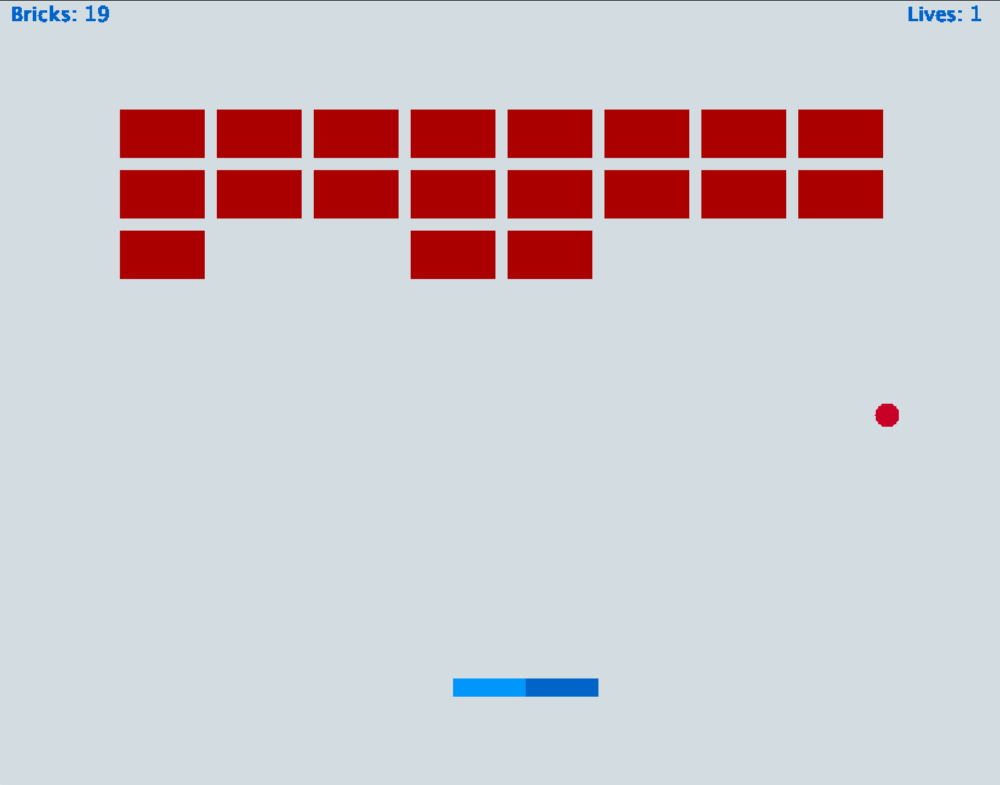

# BrickBreaker

The following project is a Java application that allows a single user to play the popular brick breaker game. 

I used Java 8, alongisde JPanels & JFrames to create a smooth interface which the users can interact with. 
 - The entire frontend of the application as well as the game physics were programmed from scratch.
 - Build and run using gradle!

</img>
